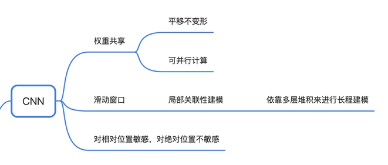
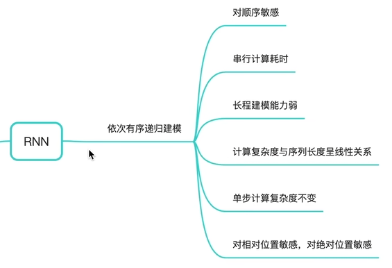
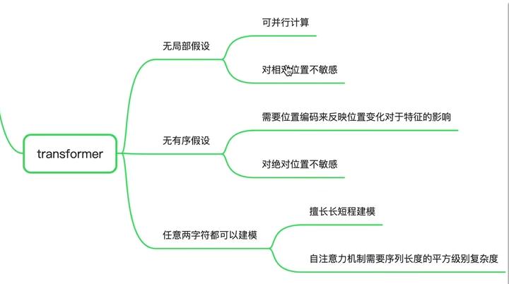
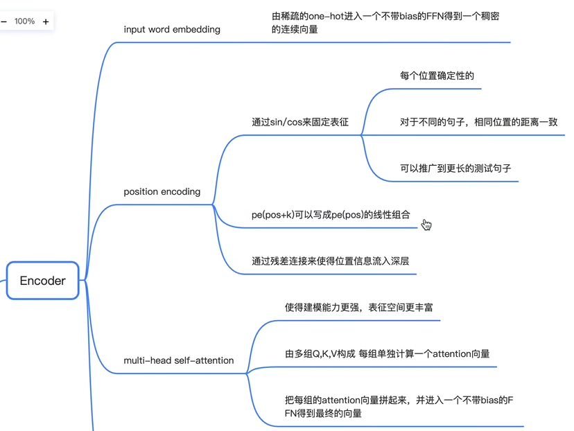
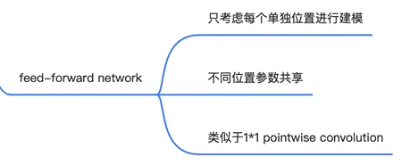
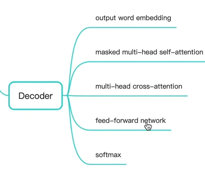

# 

**平移不变性**:从左到右做一次卷积和从右到左做一次卷积的结果是一样的，或者旋转一下，正着做与反着做的结果是一样的；

**局部关联性建模**：每次只把重点放在一个小局部里面，如果需要长程建模的话只能通过多层卷积，因为每次卷积只能对输入的一个局部范围进行建模

依次有序列地进行递归建模，当前时刻输出必须以来于上一时刻的结果

sin/cos的这种线性组合，例如pe(pos + k)可以写成pe(pos)的线性组合，这样做的好处就是即使测试集中出现了训练集中没有出现的样本，这种线性组合也可以很好地进行推广【例如sin(x + y) = sinx * cosy + siny * cosx】

在 Transformer 架构中，Decoder 的 masked multi-head self-attention 采用掩码机制，是为了确保模型在生成序列时遵循因果律，即模型只能参考之前生成的词语，而不能看到未来的词语

**Masked 多头自注意力机制** 的核心在于使用一个掩码矩阵 (Mask Matrix) 来屏蔽未来的词语，使模型无法访问它们。这个掩码矩阵是一个下三角矩阵，对角线及以下部分为 1，表示可以访问，对角线以上部分为 0，表示无法访问。